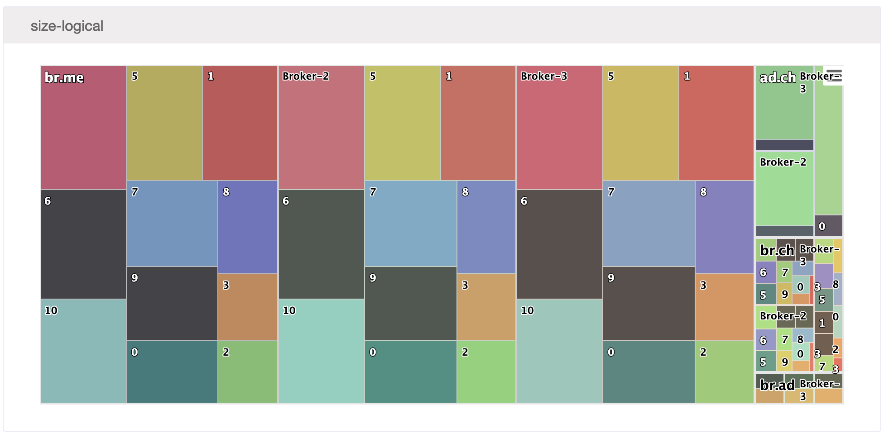
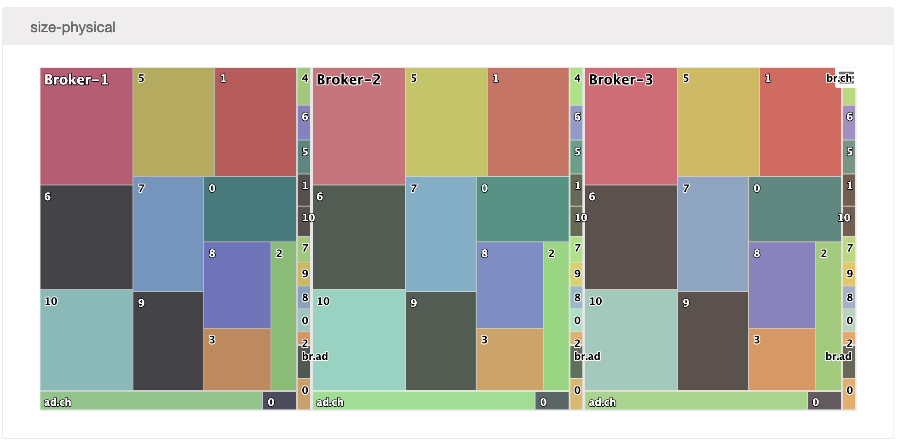

# Into Factor House.

## Introduction

Thanks for taking the time to have a conversation with us.

This is a take-home technical test designed to be fun and allow you to show a little creativity.

It is based on real code that we have implemented more than once.

Feel free to contact us to ask questions, we're here to help (to a degree!). There is no time-limit on this challenge, take as long or as little as you like.

Once you are ready, reply to the email you received and come to our offices for a chat about your solution.

## Details

You will likely want to install Leiningen, once installed you can run 'lein test' in the root directory to run tests.

Use whatever IDE you like, at Factor House we use all of them. If you're new to Clojure Intellij+Cursive might be easiest.

There are three files:

1. [factorhouse.kafka.topic.clj](src/factorhouse/kafka/topic.clj) contains two functions that we would like you to implement
2. [factorhouse.kafka.topic-test.clj](test/factorhouse/kafka/topic_test.clj)  contains three tests that currently fail
3. [factorhouse.test.data.cljc](test/factorhouse/test/data.clj) contains the test data and description of what it all means

There are is one principal technical challenge:

1. Implement the factorhouse.kafka.topic/sizes function, causing the first test to pass.

There is an extension technical challenge:

2. Implement the remaining functions, causing all the tests to pass.

Good luck!

## Reality

The final form of the data in the extension test is used to generate tree graphs that look like the following:

These are devcards, in case you're interested in that sort of thing. The backbone of our UI stack.

## Copyright / License

Copyright © 2023 Factor House Pty. Ltd.

Distributed under the Eclipse Public License either version 2.0 or (at your option) any later version.